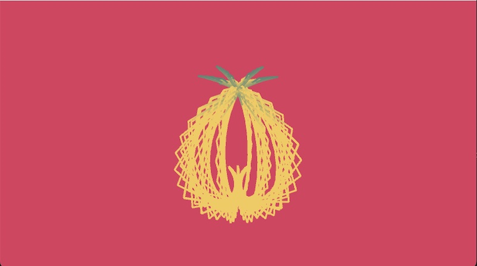

# Fun with 3D Knots!

I started with [Daniel Shiffman's](https://thecodingtrain.com/challenges/87-3d-knots) 3D Coding challenge code and tweaked the parameters a little to come up with the following knots.

This is the key part of Daniel's code:

`float r = 100*(0.8 + 1.6 * sin(6 * beta));`  
`float theta = 2 * beta;`  
`float phi = 0.6 * PI * sin(12 * beta);`  
`float x = r * cos(phi) * cos(theta);`  
`float y = r * cos(phi) * sin(theta);`  
`float z = r * sin(phi);`  
`vectors.add(new PVector(x,y,z));`
`beta += 0.01;`

All I have done is replaced the constants with variables so I could play around with the parameters.

`float r = 90*(j + sc * sin(k * beta));`  
`float theta = t * beta;`  
`float phi = l * PI * sin(m * beta);`  
`float x = r * cos(phi) * cos(theta);`  
`float y = r * cos(phi) * sin(theta);`  
`float z = -r * sin(phi);`  
`vectors.add(new PVector(x,y,z));`  
`beta += f;`

## Lacy version of 3d Knot

The only thing I changed to get the first version is the incrementation.

`float f = 0.05;`

## Lacy Knot ornament

Here are the parameters for the lacy knot "ornament".

`float j = 0.8;`
`int k = 16;`
`float l = 0.6;`
`int m = 8;`
`float sc = 1.22;`
`float f = 0.05;`

- [Code](https://github.com/kfahn22/3D_knot/tree/main/new_knot_thingy)

## My husband the chemist says this is NOT a snowflake

Reasoning: not hexagonal and planar, or columnar (under certain conditons of humidity and temperature).

Here are the parameters for the NOT a snowflake knot: 

`float j = 1.2;`   
`int k = 36;`    
`float l = 0.4;`  
`int m = 6;`  
`int t = 2;`  
`float sc = 1.0;`  
`float f = 0.05;`  

This is really two knots rendered at the same time, with one rotated by PI/2.

- [P5 sketch](https://editor.p5js.org/kfahn/sketches/ZVNioy7LJ)
- [Code](https://github.com/kfahn22/3D_knot/tree/main/not_a_snowflake)

## Pineapple knot

Here are the parameters for a version I am calling the pineapple knot.

`float j = 0.8;`  
`int k = 12;`  
`float sc = 1.4;`  
`float f = 0.05;`  

- [Code](https://github.com/kfahn22/3D_knot/tree/main/pineapple)
